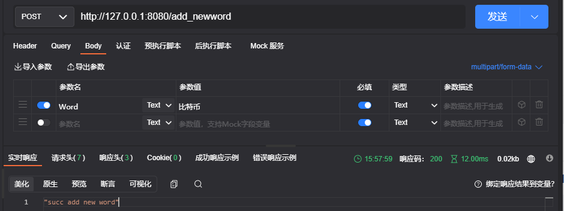
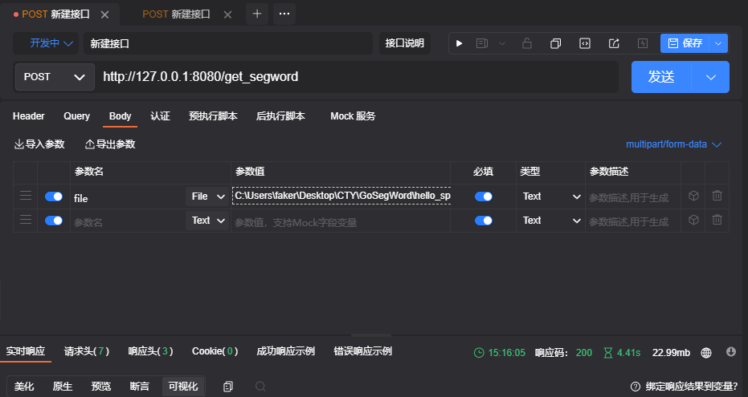
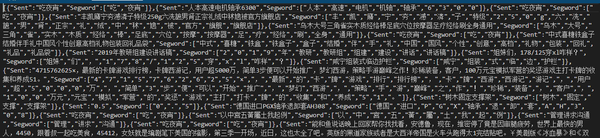

### 本项目是基于Golang的[Gin web](https://github.com/gin-gonic/gin#serving-static-files)框架和[gojieba](https://github.com/yanyiwu/gojieba)分词框架搭建的分词应用

## 🚩 **New Features/Updates**

- ✅ 提供了添加新词API
- ✅ 提供了上传log文件进行分词并返回json格式的分词API
- ✅ 实现了多协程的分词机制
- ✅ 添加了分词提取的相关脚本

## 🔧 Dependencies and Installation

```##
#Dependencies
Golong 1.18
gin  v1.7.7
gojieba v1.1.3

#installation dependencies and run
go mod tidy
go run ./main.go

```

## ⚡️ API

我们将服务部署在本地127.0.0.1:8080端口

```
#添加新词api 
http://127.0.0.1:8080/add_newword

#上传log文件进行分词api
http://139.224.17.6:8080/get_segword

```

## 🐢 View(apiPost请求示意图)

```
#添加新词api 
http://127.0.0.1:8080/add_newword
```



```
#上传log文件进行分词api
http://139.224.17.6:8080/get_segword
```



返回的json结果



## ⏳  测试报告

**测试环境**: cpu:i7-7700 内存:16g 硬盘:500g

**测试平台**: wsl2 ubuntu20.04

**测试分词语料**:  pullword.2021-11-01.log（132M 共有2170058行数据，根据并发进程数，使用seg_file.sh脚本进行分割）

| 并发进程数 | 分词线程数 | 分词时间ms | 分词速度mb/s |
| ---------- | ---------- | ---------- | ------------ |
| 2          | 1          | 3844       | 17.1696      |
| 2          | 5          | 3612       | 18.2724      |
| 2          | 8          | 3280       | 20.1219      |
| 2          | 10         | 3143       | 20.999       |
| 5          | 1          | 3581       | 7.372        |
| 5          | 5          | 1476       | 17.88        |
| 5          | 8          | 1407       | 18.7633      |
| 5          | 10         | 1391       | 18.9791      |
| 10         | 1          | 1918       | 7.247        |
| 10         | 5          | 761        | 17.6         |
| 10         | 8          | 650        | 20.615       |
| 10         | 10         | 600        | 22.333       |

## 🌏 致谢

本实习项目由梁斌大佬提供，在此由衷感谢梁博给我这一次做项目的机会
